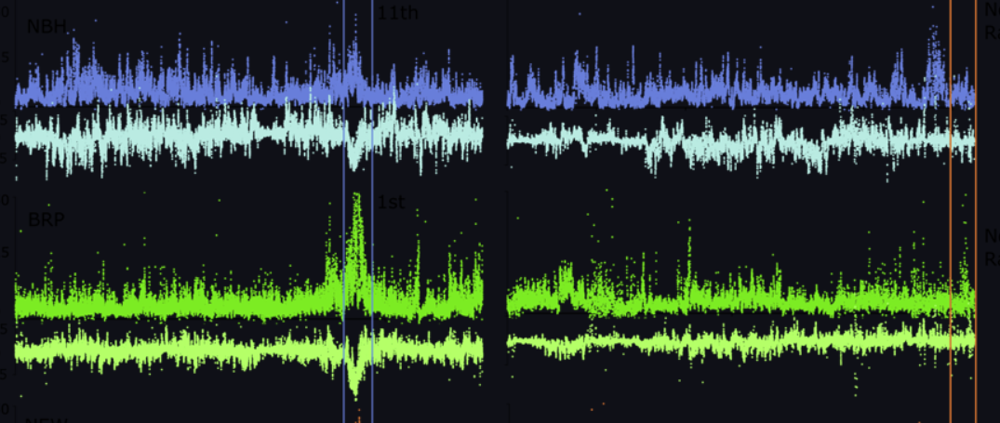

# gen711-811-example

## Project Title  

## Authors  

## Background  

### even smaller but highlighted text
We were interested... Author et al. 2019 assembled the genome of ... We compared. 

## Methods

Author et al. 2019 sequences we downloaded from ... 

Our files were in fastqz

We used X programs loaded with a conda environment on the RON computing cluster ...

or

We ran our analysis on a laptop...

We ran into this issue...

## Findings


Figure 1. Provide figure descriptions- indicate how figure was made (programs), with which data. Make sure to cite everything you used. 

### Note:
To add a plot from the 'figs' folder, there needs to be a line in this document that looks like this:
```

```
